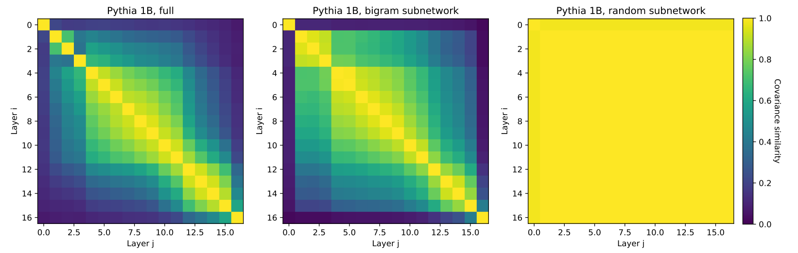

# Bigram Subnetworks: Mapping to Next Tokens in Transformer Language Models

We release bigram subnetworks as described in [Chang and Bergen (2025)](https://tylerachang.github.io/).
These are sparse subsets of model parameters that recreate bigram predictions (next token predictions conditioned only on the current token) in Transformer language models.
We provide easy-to-use code to evaluate how other circuits change model behavior when added to these <i>minimal</i> and <i>interpretable</i> bigram subnetworks, thus evaluating circuit <i>sufficiency</i> for hypothesized target behaviors.

More generally, we provide simple code to run GPT-2 and Pythia models when specific subnetworks (e.g. specific attention heads or MLP dimensions) are dropped or included.

<picture>

</picture>

We currently have bigram subnetworks trained for Pythia models up to 1B and GPT-2 models up to GPT-2 large. Pythia 1.4B and GPT-2 XL will be uploaded soon!

## Using bigram subnetworks.

First, we provide code to test the behavior of the bigram subnetwork for a model, with or without another circuit added.
To define parameters to keep, we use a subnetwork dictionary that maps the original model parameter names to numpy binary masks with the same shapes as the original model parameters (1: keep, 0: drop).
We can then load a standard GPT-2 or Pythia model, but with the parameters kept according to the mask.
The following code should be run in Python from the same directory as `circuit_loading_utils.py`:

```
from circuit_loading_utils import load_bigram_subnetwork_dict, load_subnetwork_model
mask_dict = load_bigram_subnetwork_dict('EleutherAI/pythia-1b')
model, tokenizer, config = load_subnetwork_model('EleutherAI/pythia-1b', mask_dict)
```

Note on dependencies: for all the code in this README, only `circuit_loading_utils.py` is needed! The only notable dependencies for this file are Hugging Face transformers and huggingface_hub.

## Creating your own circuit.

Note that `load_subnetwork_model` only requires a mask dict of parameters to keep.
We provide some utility functions to set up a custom circuit of parameters to keep or drop.
Note that by default, token embeddings, token unembeddings, and layernorm parameters are always kept.

```
from circuit_loading_utils import (load_bigram_subnetwork_dict,
    load_empty_subnetwork_dict, load_full_subnetwork_dict,
    load_subnetwork_model, set_attention_head, set_mlp_dimensions)

# Load the bigram subnetwork dict as above:
mask_dict = load_bigram_subnetwork_dict('EleutherAI/pythia-1b')

# Or start with an empty or full subnetwork dict:
mask_dict = load_empty_subnetwork_dict('EleutherAI/pythia-1b')
mask_dict = load_full_subnetwork_dict('EleutherAI/pythia-1b')
```

To set a specific attention head to be kept or dropped:
```
layer = 0
head_index = 1
mask_dict = set_attention_head(mask_dict, layer, head_index, to_keep=True)
```

To set a specific MLP dimension to be kept or dropped (treating MLP layers as key-value memories as in [Geva et al., 2021](https://aclanthology.org/2021.emnlp-main.446/)):
```
layer = 0
mlp_dimensions = [400, 401, 402, 403]
mask_dict = set_mlp_dimensions(mask_dict, layer, mlp_dimensions, to_keep=True)
```

Or, manually set some parameters:
```
mask_dict['gpt_neox.layers.0.attention.query_key_value.weight'][:, :100] = True
```

Finally, load the model as before:
```
model, tokenizer, config = load_subnetwork_model('EleutherAI/pythia-1b', mask_dict)

```

## Using the models.

The models are then just Hugging Face models with the usual Pythia (GPTNeoXForCausalLM) and GPT-2 (GPT2LMHeadModel) classes.
They can be used as normal.
As an example for text generation (after running the code above):

```
import transformers
generator = transformers.pipeline('text-generation', model=model, tokenizer=tokenizer)
input_text = 'This is'
print(generator(input_text, max_new_tokens=25)[0]['generated_text'])
```

## Citation.
<pre>
@article{chang-bergen-2025-bigram,
  title={Bigram Subnetworks: Mapping to Next Tokens in Transformer Language Models},
  author={Chang, Tyler A. and Bergen, Benjamin K.},
  journal={Preprint},
  year={2024},
}
</pre>
